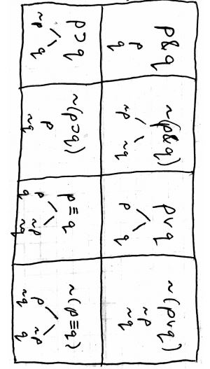

# PHIL 201 Final Study Guide

## Contents
* Sentential Logic
    * Definitions
    * Translations
    * Truth Tables
    * Truth Trees
    * Changing Rules
    * Proofs
* Predicate Logic
    * Definitions
    * Translations
    * Truth Trees

## Sentential Logic
The branch of symbolic logic that deals with the relationships formed between propositions by connectives such as and, or, and if as opposed to their internal structure.

### Definitions
* Logical Equivalency: 
`For each permutation of true and false for each sentence, the same truth value is derived`

* Connective:
`A word or phrase used to connect two sentences, resulting in a new sentence`

* Truth Functional:
`The truth or falsity of a sentence. Is determined solely by the truth or falsity of its parts`

* Argument:
`A set of sentences, one of which is a conclusion`

* Consistent:
`If all sentences can be true at the same time`

* Logically True:
`there is no way for it to be false`

* Valid:
`there is no way for the premises to be true and the conclusion false`

* Atomic Sentence:
`a sentence with no smaller sentence as a part`

* Antecedent/Consequent:
`If A (antecedent), then B (consequent).`

* Sentential Logic:
`Basic unit is atomic sentences, using connectives`

* Sound:
`A test is sound if it gives no false positives`

* Complete:
`A test is complete if it gets all of the correct positives`

* Effective:
`A test is effective if it always gives an answer`


### Translations
You are given a sentence in English and asked to translate to Sentential Logic

if given the following relationships, answer 1-3:
```
A. He will go fishing.
B. He will buy soda.
C. It will rain. 
```

1. He won't go fishing whether he buys soda or not.
```
~A & (B v ~B)
explanation: He won't go fishing (~A) whether (&) he buys soda (B) or (v) not (~B).
```
2. He will go fishing and buy soda, unless it rains.
```
(A & B) v C
explanation: go fishing (A) and (&) buy soda (B), unless (v) it rains (C)
```
3. He will go fishing even though he will buy soda.
```
A & B
explanation: go fishing (A) even though (&) buy soda (B)
```

### Truth Tables
When given a sentench joined by a connector, the following relationships can be found by the truth table:

| A  | B  | ~ A |A & B|A v B|A ⊃ B|
|:--:|:--:|:--: |:--: |:--: |:--: |
| T  | T  | F   | T   | T   | T   |
| T  | F  | F   | F   | T   | F   |
| F  | T  | T   | F   | T   | T   |
| F  | F  | T   | F   | F   | T   |


### Truth Trees
Rules:


### Changing Rules

### Proofs

## Predicate Logic

### Definitions

### Translations

### Truth Trees